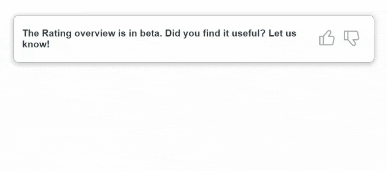
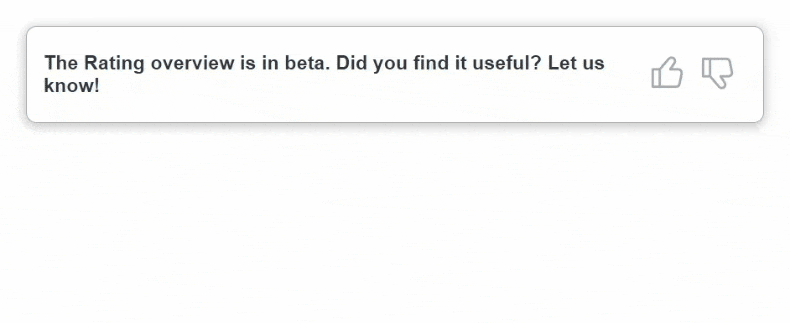
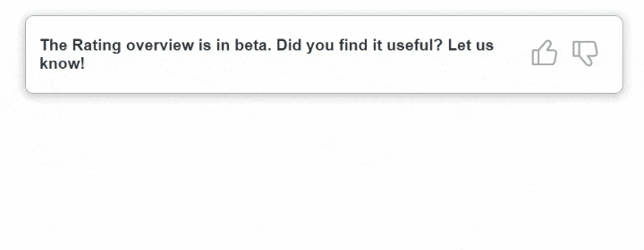
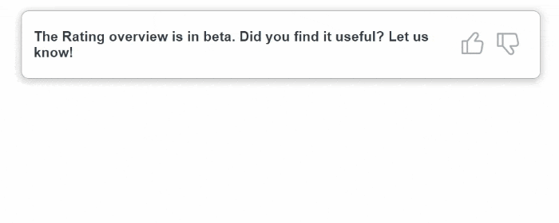
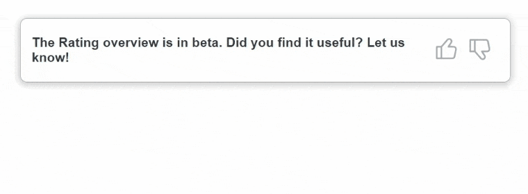

# Feedback Component

### Краткое описание

Переиспользуемый JavaScript-компонент для сбора пользовательского фидбэка с возможностью настройки опций.

### Демо

<p align="center">
  
</p>

---

### Опции

| Опции                  | Тип          | По умолчанию | Описание                                                        |
| -----------------------| ------------ | -------------| --------------------------------------------------------------- |
| [`title`](#)           | `string`     |              | Заголовок компонента.                                           |
| [`onSubmit`](#)        | `function`   |              | Функция обработки отправления данных из компонента на сервер. Функция должна возвращать промис.  |
| [`controls`](#)        | `array`      |              | Массив с объектами настроек кнопок и комментариев. Количество кнопок не ограничено.|
| [`btn`](#)             | `object`     |              | Объект настроек кнопки. Принимает `element` и `value`.          |
| [`element`](#)         | `HTMLElement`|              | Внешний вид кнопки.                                             |
| [`value`](#)           | `string`     |              | Значение кнопки реакции, которое отправится на сервер при его выборе. |
| [`commentOptions`](#)  | `object`     |              | Объект настройки комментария. Принимает `required`, `subtitle`, `placeholder`.  Если объект не передан, блок комментария не будет появляться.|
| [`required`](#)        | `boolean`    | `false`      | Значение определяющие обязательный ли комментарий.              |
| [`subtitle`](#)        | `string`     |              | Заголовок комментария.                                          |
| [`placeholder`](#)     | `string`     | `''`         | Placeholder внутри элемента комментария.                        |

---

### Пример использования

```js
import UIButton from './UI/button.js';

const feedback = document.getElementById('feedback');

const feedbackComponent = FeedbackComponent({
  title: 'The Rating overview is in beta. Did you find it useful? Let us know!',
  onSubmit: (e, form) => {
    e.preventDefault();
    return fetch('url', {
      method: 'POST',
      body: new FormData(form)
    }).then((response) => response.json())
      .then(() => form.remove());
  },
  controls: [
    {
      btn: {
        element: UIButton('like'),
        value: 'like',
      },
      commentOptions: {
        required: true,
        subtitle: 'Why did you selected useful?',
        placeholder: 'Your feedback...',
      },
    },
    {
      btn: {
        element: UIButton('dislike'),
        value: 'dislike',
      },
      commentOptions: {
        required: false,
        subtitle: 'Why did you selected not useful?',
        placeholder: '...',
      },
    },
  ]
})

feedback.append(feedbackComponent);
```

---
### Передача onSubmit

В `onSubmit` вы можете обрабатывать поведение компонента после успешной его отправки на сервер. Например удалить его:

```js
onSubmit: (e, form) => {
    e.preventDefault();
    return fetch('url', {
      method: 'POST',
      body: new FormData(form)
    }).then((response) => response.json())
      .then(() => form.remove());
  },
```

Или показать сообщение что фидбэк успешно отправлен:

```js
  onSubmit: (e, form) => {
    e.preventDefault();
    return fetch('url', {
      method: 'POST',
      body: new FormData(form)
    }).then((response) => response.json())
      .then(() => {
        const span = document.createElement('span');
        span.textContent = 'Feedback sent successfully!'
        span.style.color = 'green';
        form.after(span);
        form.remove();
      });
  },
```
---

### Встроенная обработка ошибок

Если при отправки данных на сервер происходит ошибка, пользователь увидит предупреждение:

<p align="center">
  
</p>

---

### Примеры поведения компонента

  <p>Комментарий опционален (required: false):</p>
  

  <p>Комментарий обязательный (required: true):</p>
  

  <p>Без блока комментария:</p>
  

---

  ### Детали поведения компонента

  - Кнопок может быть разное количество. Вы сами выбираете их UI и данными которые отправятся при ее выборе.
  - Кнопка может быть выбрана только одна. При переключении между кнопками ранее введенные данные из блока комментария удаляются.
  - Форма уже содержит данные выбраной пользователем кнопки и комментария. Для отправки данных на сервер достаточно использовать  `new FormData(form)`, где `form` – элемент формы. Переданное значение на сервер будет формата `{ value: string, text: string }`, где `value` – значение выбранной кнопки, `text` – текст комментария.
