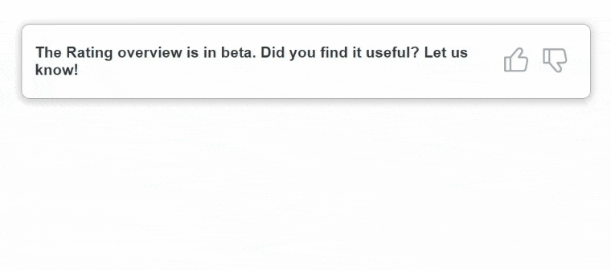
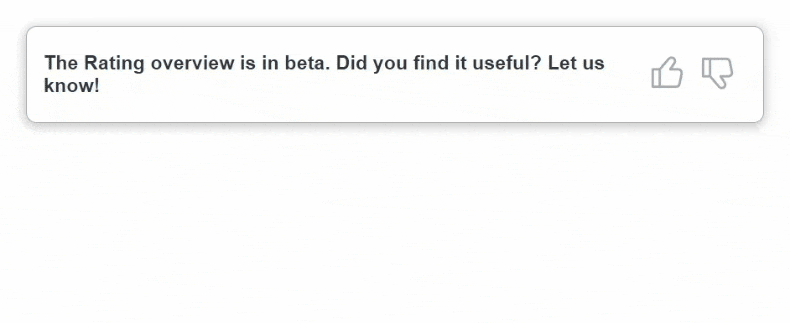
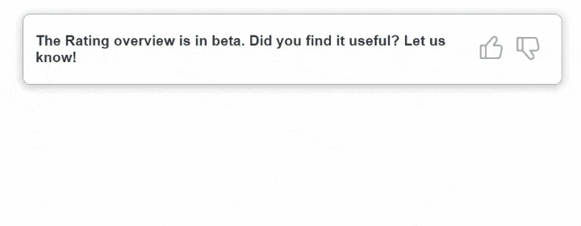
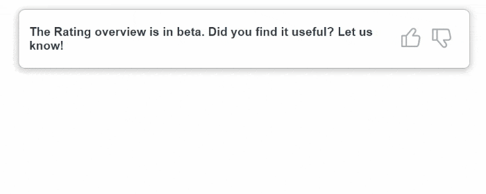
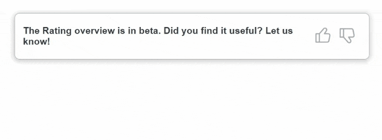

# React Feedback Component

### Краткое описание

Переиспользуемый React-компонент для сбора пользовательского фидбэка с возможностью настройки опций.

### Демо

<p align="center">
  
</p>

---

### Опции

| Опции                 | Тип        |Описание         |
| --------------------- | ---------- |------------------------------------------------------------------------------------------------------------------------------------------ |
| [`title`](#)          | `string`   | Заголовок компонента.                                                           |
| [`onSubmit`](#)       | `function` | Функция обработки отправления данных из компонента на сервер. Функция должна возвращать промис. |
| [`controls`](#)       | `array`    | Массив с объектами настроек кнопок и комментариев. Количество кнопок не ограничено.     
| [`id`](#)             | `string \| number`  | Значение элемента, которое отправится на сервер, при его выборе.     |
| [`component`](#)      | `React.ElementType` | Компонент реакции.              |
| [`commentOptions`](#) | `object`   | Объект настройки комментария. Принимает `required`, `title`, `placeholder`.  Если объект не передан, блок комментария не будет появляться. |
| [`required`](#)       | `boolean`  | Значение определяющие обязательный ли комментарий.           |
| [`title`](#)          | `string`   | Заголовок комментария.                                |
| [`placeholder`](#)    | `string`   | Placeholder внутри элемента комментария.               |

---

### Пример использования с обработкой успешного завершения отправки фидбэка

```tsx
import { useState } from 'react';
import { FeedbackComponent, OnFeedbackSubmit } from '@/components/Feedback/Feedback';
import { LikeButton } from '@/components/UI/LikeButton/LikeButton';
import { DislikeButton } from '@/components/UI/DislikeButton/DislikeButton';
import '@/widgets/SimpleFeedback/SimpleFeedbackWidget.css';

const title = 'The Rating overview is in beta. Did you find it useful? Let us know!';
const controls = [
  {
    id: 'like',
    component: LikeButton,
    commentOptions: {
      required: true,
      title: 'Why did you selected useful?',
      placeholder: 'Your feedback...',
    },
  },
  {
    id: 'dislike',
    component: DislikeButton,
    commentOptions: {
      required: false,
      title: 'Why did you selected not useful?',
      placeholder: 'Write here...',
    },
  },
];

export const SimpleFeedbackWidget = () => {
  const [isSubmitted, setIsSubmitted] = useState(false);

  const handleSubmit: OnFeedbackSubmit = (data) => {
    return fetch('url', {
      method: 'POST',
      body: JSON.stringify(data),
    }).then((response) => response.json())
      .then(() => setIsSubmitted(true))
  };

  return (
    <div className='simple-feedback'>
      {!isSubmitted && (
        <FeedbackComponent title={title} controls={controls} onSubmit={handleSubmit} />
      )}
    </div>
  );
};

```

---
### Создание кнопок реакции

Для создания кнопки можно воспользоваться компонентом `<BaseButton />`, в который необходимо передать пропс `children` и все необходимые аттрибуты:

```tsx
import LikeIcon from '@/assets/like.svg';
import { BaseButton, BaseButtonProps } from '@/components/UI/BaseButton/BaseButton';

interface Props extends Omit<BaseButtonProps, 'children'> { }

export const LikeButton = ({ ...btnAttributes }: Props) => (
  <BaseButton {...btnAttributes} className={`like-button ${btnAttributes.className || ''}`}>
    <LikeIcon />
  </BaseButton>
);

```
---

### Встроенная обработка ошибок

Если при отправки данных на сервер происходит ошибка, пользователь увидит предупреждение:

<p align="center">
  
</p>

---

### Примеры поведения компонента

  <p>Комментарий опционален (required: false):</p>
  

  <p>Комментарий обязательный (required: true):</p>
  

  <p>Без блока комментария:</p>
  

---

### Детали поведения компонента

  - Кнопок может быть разное количество. Вы сами выбираете их UI и данные которые отправятся при ее выборе.
  - Кнопка может быть выбрана только одна. При переключении между кнопками ранее введенные данные из блока комментария удаляются.
  - При срабатывании события submit, в `onSubmit` передается объект `data`, который сдержит данные формата `{ reaction: string | number, comment: string }`, где `reaction` – значение выбранной кнопки реакции, `comment` – текст комментария. Этот объект необходимо использовать для отправки данных на сервер.


### Назначение зависимостей в проекте 
  - jest: Фреймворк для тестирования JavaScript-кода.
  - jest-environment-jsdom: Предоставляет среду выполнения для Jest, имитируя браузерную среду с использованием jsdom.
  - babel-jest: Зависимость, позволяющая Jest понимать синтаксис импорта и экспорта ES модулей, используя Babel.
  - @testing-library/react: Предоставляет утилиты для тестирования React-компонентов.
  - @types/jest: Пакет с типами TypeScript для Jest.
  - @typescript-eslint/eslint-plugin и @typescript-eslint/parser: Предоставляют поддержку TypeScript для ESLint.
  - eslint: Инструмент для статического анализа кода с целью выявления потенциальных проблем и обеспечения согласованности в стиле кодирования.
  - eslint-plugin-react-hooks: Плагин для ESLint, предоставляющий правила для проверки корректного использования хуков React.
  - eslint-plugin-react-refresh: Плагин для ESLint, предоставляющий правила для работы с механизмом Hot Module Replacement (HMR) в React.
  - @babel/preset-env, @babel/preset-react, @babel/preset-typescript: Предустановленные настройки Babel для поддержки современного-JavaScript, React и TypeScript.
  